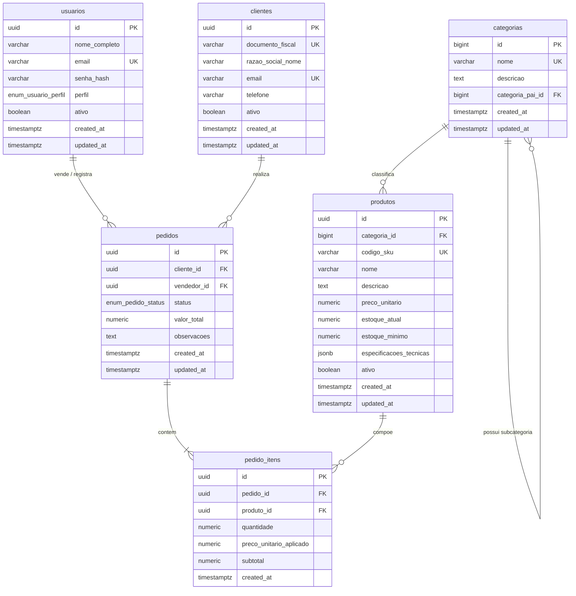

# AlmoxarifadoPro - Modelagem Relacional de Dados

Este repositório contém a especificação e o script de criação do banco de dados relacional para o sistema transacional (OLTP) de gestão empresarial e almoxarifado, projetado para PostgreSQL 14+.

O script SQL completo e pronto para execução encontra-se em [schema.sql](file:///c:/Users/Antigravity2/Documents/Lucas/AlmoxarifadoPro/schema.sql).

---

## Diagrama Entidade-Relacionamento (ER)

Abaixo está o diagrama representativo das entidades, seus atributos essenciais, chaves e cardinalidades gerado via Mermaid:

---

## Descrição das Entidades e Relacionamentos

| Entidade | Descrição | Chave Primária | Principais Relacionamentos |
| :--- | :--- | :--- | :--- |
| `usuarios` | Operadores e administradores com controle de acesso | `UUID` | 1:N com `pedidos` (como vendedor/operador) |
| `clientes` | Pessoas físicas ou jurídicas compradoras | `UUID` | 1:N com `pedidos` |
| `categorias` | Classificação taxonômica hierárquica | `BIGINT IDENTITY` | 1:N auto-relacionamento (`categoria_pai_id`); 1:N com `produtos` |
| `produtos` | Catálogo de itens e controle de estoque físico | `UUID` | N:1 com `categorias`; 1:N com `pedido_itens` |
| `pedidos` | Transação de venda/movimentação comercial | `UUID` | N:1 com `clientes`; N:1 com `usuarios`; 1:N com `pedido_itens` |
| `pedido_itens` | Itens vinculados a um pedido com snapshot de preço | `UUID` | N:1 com `pedidos`; N:1 com `produtos` |

---

## Destaques Arquiteturais e Decisões de Design

1. **Identificadores Distribuídos e Sequenciais:**
   - Tabelas de alto volume transacional usam `UUID` gerado nativamente via `gen_random_uuid()` para segurança e escalabilidade.
   - Tabelas dimensionais menores (ex.: `categorias`) usam `BIGINT GENERATED BY DEFAULT AS IDENTITY`.

2. **Integridade e Consistência (3FN):**
   - Histórico contábil: `pedido_itens.preco_unitario_aplicado` mantém o valor acordado no momento da venda, isolando-o de alterações futuras em `produtos.preco_unitario`.
   - Colunas computadas: `pedido_itens.subtotal` utiliza `GENERATED ALWAYS AS (quantidade * preco_unitario_aplicado) STORED`, assegurando consistência em nível de banco de dados sem dependência de lógica externa.
   - Desnormalização controlada: `pedidos.valor_total` armazena o somatório pré-consolidado para alta performance em listagens e relatórios OLTP.

3. **Flexibilidade Controlada:**
   - `produtos.especificacoes_tecnicas` utiliza `JSONB` com índice GIN (`jsonb_path_ops`), permitindo metadados variáveis sem o custo de manutenção de um modelo EAV (*Entity-Attribute-Value*).

4. **Auditoria Temporal:**
   - Triggers automáticos com a função `set_updated_at_timestamp()` atualizam a coluna `updated_at` a cada operação de `UPDATE`.
