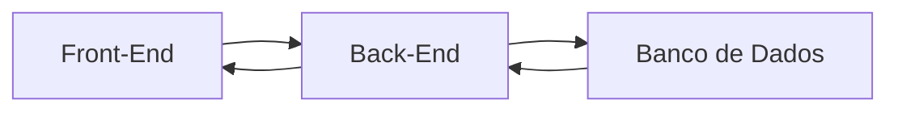

# Meu Curso Desenvolvimento com Antigravity

**Início:** 19/09/2026
**Local:** Escola SENAI Americana

## Módulo 1 - Introdução & Nivelamento

- Hardware, Software e Sistemas Operacionais

- Preparando o Ambiente de Desenvolvimento
    - VsCode: Editor de Texto /IDE;
    - Criação da WorkSpace;
    - Arquivos e Extensões;
    - Softwares de Versionamento;
    > Versionamento: Processo de Registrar e gerenciar todas as alterações feitas nos arquivos de um projeto ao longo do tempo.
        
        - GIT: Versionamento Local;
        - Github: Versionamento na Nuvem;

### Configurando o GIT e o GITHUB

Conectar Git ao Github, diitar o seguinte Comando: bash/cmd:

`git config --global user.name "Lucaseduardo583"`

`git config --global user.email "sardelarilucas@gmail.com"`

Confirmar com o comando:
`git config --list` 

### O Processo de Desenvolvimento

**"Como um Software é feito"**
* Programar é dar ordens extremamnte detalhadas e lógicas para o computador. É como escrever uma receita de bolo passo a passo.

**Arquitetura Básica de um Software**

* Front-End (A Interace): É tudo que o usuário, vê, clica, e interage.
* Back-End (O Cerebro): É a coznha do Restaurate. Recebe as requisiçoes, pocessa de acordo com a logica e devolve uma resposta para UI(User Interface).
* Banco de Daos (A memória): É onde guardamos as informações permanentes: logins, senhas, históricos, mensagens...

### MEu Primeiro Projeto Antigravity

** O Contexto (O que vamos Construir)**

* Gerenciador de Tarefas: HTML, CSS, JavaScript

* O Prompt para o Antigravity:

"Atue como um desenvolvedor web sênior. Quero criar um aplicativo de 'Lista de Tarefas' simples e bonito. Por favor, gere os 3 arquivos necessários (HTML, CSS e JavaScript) seguindo estas regras:
1. Front-end (Interface - HTML e CSS):
Crie um título centralizado chamado 'Meu Dia'.
Crie um campo de texto para digitar a tarefa e um botão azul escrito 'Adicionar'.
Abaixo, crie uma lista onde as tarefas vão aparecer.
Use um design moderno, com cantos arredondados e fundo claro.
2. Back-end/Lógica (JavaScript):
Quando eu clicar em 'Adicionar', a tarefa deve ir para a lista.
Se o campo estiver vazio, mostre um alerta pedindo para digitar algo.
Coloque um botão vermelho de 'Excluir' do lado de cada tarefa.
3. Banco de Dados / Memória:
Use o 'LocalStorage' do navegador para salvar as tarefas. Assim, se eu fechar a página e abrir de novo, minhas tarefas ainda estarão lá.
Forneça o código completo e separado de cada arquivo."